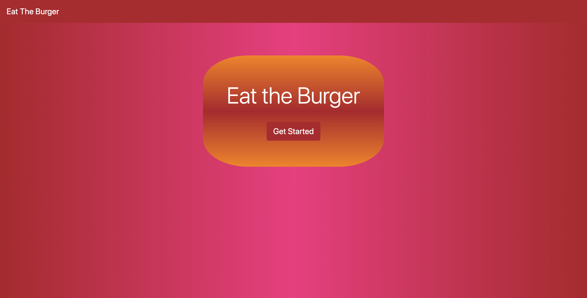
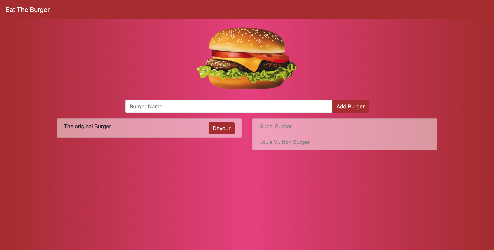

# Eat the Burger [](https://opensource.org/licenses/MIT)

## Table Of Contents

1. [License](#license)

2. [Description](#description)

3. [Installation](#installation)

4. [Usage](#usage)

5. [Questions](#questions)

## Description

[Deployed app](https://obscure-waters-25378.herokuapp.com/)

The main purpose of this project was to implement MVC(model-view-controller) paradigm in my code.

Technologies used are: Node, jQuery, CSS, HTML, Handlebars, relational DB MySql, Heroku for deployment.

In this application you create a burger; then, it waits to be devoured. After devoured button is pressed, the burger gets saved into database as devoured.

## Installation

To install the application, clone the repository in your CLI by inserting the command:

```bash
git clone git@github.com:paveldarii/Eat-the-burger.git
```

Then, in your CLI go to the home directory of the app and type there:

```bash
npm i
```

Next, you will need to create a database:
In your CLI, go to "db" folder, then write:

```bash
mysql -y root -p<your_db_password_goes_here>
```

Mysql being open in your CLI, type:

```bash
 source schema.sql
```

```bash
 source seeds.sql
```

```bash
exit
```

After you run all this commands, your database should be created and populated with some info from seeds.sql file.

The last thing you will need to do in order to instal the app is to make connection to the database.
Therefore, in your home directory create a file named (.env).
After you created the file, you need to insert there the variables from the home directory file (.env.example), and add values to those variables.

If you completed all the steps above, your application should work successfully on you computer, and you can start it by running in your CLI:

```bash
node server.js
```

or

```bash
npm run dev
```

## Usage

[Deployed app](https://obscure-waters-25378.herokuapp.com/)

To start the application, press "Get Started."



In the text field type the burger name; then, press "Add Burger."



Then, you can keep the burger uneaten or you can eat it by pushing "Devour" button.
Devoured burgers will be added to the list on the right side.
To return to the start page use home field from top left side of the page.

## Questions

My GitHub profile: [https://github.com/paveldarii](https://github.com/paveldarii).

My email address: paveldarii@yahoo.com

## License

[The MIT License](https://opensource.org/licenses/MIT/)
